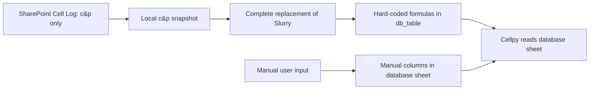

# Project Scope: One-Way Cell Log to Cellpy Database Update

Status: draft for revision  
Last revised: 2026-08-04

Execution plan: `IMPLEMENTATION_PLAN.md`  
Adversarial review: `IMPLEMENTATION_PLAN_ADVERSARIAL_REVIEW.md`  
Gate A contract: `SOURCE_CONTRACT.md`  
Gate B contract: `DB_FIELD_MAPPING.md`  
Required approvals: `MIGRATION_DECISIONS.md`

## Purpose

Safely refresh source-derived data in the Cellpy Excel database from a local copy of one hard-coded Cell Log sheet without damaging workbook structure, formulas, or manually maintained data.

This is a one-way operation:

Nothing is written back to the authoritative Cell Log. Manual database content does not flow into the source mirror. Data safety takes priority over convenience, speed, and automation.

The acquisition step necessarily reads the hard-coded `c&p` sheet in order to copy it. It must use read-only access, must not edit the source workbook, and must not enumerate, download, or process other sheets as part of the update workflow. All later processing uses only the local snapshot.

## Hard-coded production contract

The first production version intentionally uses code constants rather than user-configurable paths, sheet names, or column mappings:

| Responsibility | Hard-coded value |
|---|---|
| Source workbook | [SharePoint `Cell_Log.xlsx`](https://ifecloud.sharepoint.com/:x:/r/sites/UsersofIFEBatteryLab/_layouts/15/Doc.aspx?sourcedoc=%7BEED439B5-B14D-42A0-B992-AE5F08CC1F02%7D&file=Cell_Log.xlsx&action=default&mobileredirect=true&DefaultItemOpen=1) |
| Source sheet | `c&p` |
| Local snapshot | `source_data/Cell_Log_CP.xlsx` |
| Production workbook | `C:\Users\IFE13213\cellpy_data\db\2025_Cell_Analysis_db_001.xlsx` |
| Machine-owned mirror sheet | `Slurry` |
| Cellpy-facing sheet | `db_table` |
| Manual columns confirmed by the user | `b01`, `b02`, `b03`, `b04`, `b05`, `b06`, `b07` |
| Calculation engine | Desktop Excel calculation |

The command-line interface must not accept an alternative source URL, source sheet, mirror sheet, database sheet, database path, or column mapping. Supporting a new yearly database or schema requires an intentional code and test change.

## Workbook model

The production database is the exact hard-coded workbook `C:\Users\IFE13213\cellpy_data\db\2025_Cell_Analysis_db_001.xlsx`. The updater must not search for or guess another target.

The workbook currently has two distinct data responsibilities:

1. **Source mirror sheet** — currently named `Slurry`.
   - This name is historical and misleading; it does not define the project purpose.
   - The sheet is a machine-owned local representation of the relevant Cell Log data.
   - It must not contain manual database input that the updater is expected to preserve.

2. **Cellpy database sheet** — currently named `db_table`.
   - This is the sheet Cellpy reads.
   - Some columns contain Excel formulas that extract selected values from the source mirror sheet.
   - Other columns contain manually entered or manually maintained values.
   - Formula-managed and manual cells have different ownership and must never be treated as one replaceable table.

Observed in the current workbook snapshot:

- `Slurry`: 370 rows, 87 columns, no formulas.
- `db_table`: 363 rows, 73 columns.
- `db_table` contains 4,332 formulas across columns `A`, `C`, `O`, `P`, `Q`, `R`, `S`, `U`, `V`, `Z`, `AA`, and `AG`.
- Most of those formulas reference `Slurry` by row position; for example, `db_table!A3` references `Slurry!A4`.

The legacy hard-coded formula mapping observed in `db_table` is:

| `db_table` column | Current formula source |
|---|---|
| `A` (`id`) | `Slurry!A` |
| `C` (`batch`) | `Slurry!D` |
| `O` (`mass_active_material`) | `Slurry!AD` |
| `P` (`nominal_capacity`) | `Slurry!AI` |
| `Q` (`loading_active_material`) | `Slurry!AP` |
| `R` (`cell_type`) | `Slurry!F` |
| `S` (`tester`) | `Slurry!M` |
| `U` (`group`) | `Slurry!E` |
| `V` (`project`) | `Slurry!C` |
| `Z` (`cell`) | `Slurry!L` |
| `AA` (`file_name_indicator`) | same-row `db_table!Z` |
| `AG` (`comment_slurry`) | `Slurry!P` |

This legacy mapping targets the old 87-column `Slurry` layout and becomes invalid when `Slurry` is replaced by the 19-column `c&p` snapshot. It must not be reused as the new mapping.

Existing system-populated values include `exists = 1`, `instrument = "arbin_sql_h5"`, and `experiment_type = "cycling"`. The inspected `c&p` schema has no `experiment_type` column. The implementation must therefore make `cycling` an explicit automated system value or define a documented transformation from another source field; it must never depend on a manual edit.

The confirmed manual columns `b01` through `b07` must never receive formulas or automated values. All other currently non-formula columns are preservation-only for existing rows and blank for new rows unless this scope is revised with an explicit ownership rule.

These observations define the initial schema contract, but the implementation must still validate the expected workbook shape and formula template before every update.

## Primary goals

### 1. Copy only the hard-coded Cell Log sheet locally

- Use read-only authenticated access to the hard-coded SharePoint workbook.
- Copy only the hard-coded `c&p` sheet to the hard-coded local snapshot.
- Do not open the source workbook in desktop Excel and do not download or process the full workbook.
- Never move, rename, edit, or delete the authoritative source workbook.
- Record the source identity, retrieval time, row count, column contract, and preferably a content hash of the copied sheet data.
- Reject missing, unreadable, stale, unauthenticated, or structurally unexpected source data.

### 2. Update the database workbook where it lives

- Target only the hard-coded production workbook.
- Perform all transformations on a separate candidate copy.
- Do not modify the production workbook in place while processing.
- Replace the production workbook only after the candidate passes all validations.

### 3. Refresh the machine-owned source mirror

- Completely replace the contents of `Slurry` with the local `c&p` snapshot on every successful run.
- Preserve the workbook and sheet identities expected by formulas and Cellpy.
- Do not use a pandas round trip if it changes cell types, formatting, formulas, dates, blank cells, or workbook metadata required by the database.
- Treat the Cell Log as append-only.
- Before replacement, prove that every source ID is a valid unique value. Reconcile database rows and manual values by ID rather than by row position. Abort on missing historical IDs, blank/invalid IDs, or duplicate IDs unless an explicit migration decision resolves them.

### 4. Preserve the Cellpy database sheet

- Preserve every existing manual value unless a future scope revision explicitly authorizes changing it.
- Preserve existing formulas, formatting, validation rules, comments, column widths, row heights, and sheet structure.
- Maintain one `db_table` row for every accepted `Slurry` data row.
- Populate new rows using only the hard-coded formula mapping and hard-coded system values.
- Snapshot `b01` through `b07` by ID before rebuilding rows, restore them to the matching ID, and leave them blank for new IDs.
- Leave all other preservation-only columns blank for new rows unless an explicit hard-coded rule is added later.
- Generate formulas from an explicit formula template and mapping, not by blindly copying the last row.
- Recalculate the completed candidate through desktop Excel so cached cell values are current before Cellpy validation.
- Never rebuild or wholesale replace `db_table` from a DataFrame.

### 5. Validate before production replacement

The candidate workbook must be rejected unless all applicable checks pass:

- It opens successfully as an Excel workbook.
- The expected sheets exist exactly once.
- No unexpected sheet is added, deleted, renamed, or hidden.
- The source mirror contains the expected source records and columns.
- Existing manual cells in `db_table` are unchanged.
- Existing formulas remain formulas and retain the expected reference pattern.
- Formula-managed columns are extended correctly for any new records.
- Stable record keys are nonblank and unique where required.
- No existing database row is silently rebound to a different Cell Log record.
- Cellpy can read the candidate, or an agreed equivalent compatibility check passes.
- The candidate can be reopened after saving.

### 6. Replace production defensively

- Refuse to proceed if the production workbook is locked, changes during processing, or differs from the version used to create the candidate.
- Create a timestamped, verified backup before replacement.
- Prefer an atomic same-filesystem replacement after validation.
- Reopen and verify the production workbook after replacement.
- Retain enough evidence to identify the source, previous database, candidate, backup, and final result.
- Provide a clear recovery procedure and test it on representative copies.

## Non-negotiable invariants

1. The data flow is Cell Log to local copy to Cellpy database only.
2. Only the hard-coded SharePoint `c&p` sheet may be read, and the authoritative workbook is never modified.
3. Production is never the transformation workspace.
4. Existing `b01` through `b07` values and every other preservation-only cell are preserved cell-for-cell unless explicitly authorized otherwise.
5. A failed or interrupted run leaves the existing production workbook usable and unchanged.
6. An update targets only the hard-coded production path and refuses redirection through runtime configuration.
7. No update is reported successful until the saved workbook is reopened and validated.
8. Backup creation alone is not proof of safety; restoration must be possible and tested.
9. Manual values are associated with stable ID values, never with source row positions.
10. Formula calculation is performed by desktop Excel before Cellpy compatibility is accepted.

## Intended operating workflow

1. Authenticate read-only to the hard-coded SharePoint workbook.
2. Copy only `c&p` values to the hard-coded local snapshot without altering the source.
3. Resolve and validate the hard-coded production database path.
4. Snapshot the production workbook identity and create a working candidate.
5. Validate source IDs and reconcile them with existing `db_table` IDs.
6. Completely replace `Slurry` in the candidate from the local snapshot.
7. Rebuild matching `db_table` rows using the hard-coded formula and system-value map.
8. Restore and verify all pre-existing `b01` through `b07` values by ID.
9. Recalculate formulas with desktop Excel and save current cached values.
10. Run workbook and Cellpy compatibility validation.
11. Produce a concise change report.
12. Create and verify the rollback backup.
13. Automatically replace production defensively and verify the final file.

The intended production command performs automatic replacement after every validation gate passes. It must not be enabled against production until representative fixtures, preservation tests, Excel recalculation, Cellpy compatibility, and rollback have all been demonstrated on copies.

## Out of scope

- Two-way synchronization with the Cell Log.
- Writing manual database values back into the source mirror or Cell Log.
- Redesigning the Cellpy database schema.
- Treating the workbook as a generic relational database.
- General-purpose Excel ETL functionality.
- Editing arbitrary sheets or columns through configuration.
- Runtime overrides for the hard-coded source URL, sheet names, database path, or column mapping.
- Automatically repairing an unexpected workbook structure.
- Choosing a production database based only on a loose filename glob.
- Deleting old production databases or backups as part of the update transaction.

## Adversarial review

The following review assumes the update will eventually fail in the worst plausible way and asks what must prevent that failure.

### Critical: row position can attach manual data to the wrong record

`db_table` formulas currently map to `Slurry` by row number. If a full source refresh inserts, removes, or reorders rows, the formulas may point at different records while manual values remain on their old `db_table` rows. The workbook can look valid while silently associating manual metadata with the wrong cell or experiment.

Required control: the source is contractually append-only, but database preservation must still be ID-based. Reject duplicate, invalid, or unexpectedly missing historical IDs; restore manual values by ID after row construction. Positional preservation is forbidden.

### Critical: the current code updates the wrong conceptual layer

The current implementation describes its purpose as appending directly to `Slurry`. That misses the two-layer workbook model and does not explicitly manage formula extension or preservation of manual `db_table` cells.

Required control: replace the `update_slurry` framing with explicit source-mirror and Cellpy-database responsibilities before production use.

### Critical: Excel formulas are not calculated by `openpyxl`

Preserving a formula string is different from recalculating its cached value. If Cellpy reads cached values, a structurally valid workbook may expose stale data until opened and recalculated by Excel or another compatible calculation engine.

Required control: recalculate and save the candidate through desktop Excel, then verify Cellpy-visible cached values. Do not claim success based only on formula presence.

### Critical: manual cells can be overwritten without obvious corruption

A DataFrame export, whole-row write, copied formula row, or incorrect column boundary can replace manual values while leaving the workbook readable.

Required control: formula-owned, fixed-system, manual, and preservation-only columns are hard-coded. Compare all pre-existing manual and preservation-only cells between production and candidate before replacement. Any unexpected difference is a hard failure.

### Critical: a backup can preserve an already-wrong or incomplete state

A backup made after selecting the wrong database, after a concurrent edit, or without being reopened does not provide reliable recovery.

Required control: fingerprint the selected production file, verify the backup independently, and abort if production changes before replacement.

### High: source acquisition can select the wrong Cell Log

Falling back from the hard-coded SharePoint resource to a similarly named local or downloaded workbook can silently use the wrong data.

Required control: use only the hard-coded workbook identity and `c&p` sheet. Authentication or schema failure must stop the run; there is no fallback source search.

### High: pandas can normalize away workbook semantics

Reading and rewriting a sheet with pandas can alter formulas, dates, types, blank values, styles, and workbook-specific details even when row counts match.

Required control: define what constitutes an exact source-mirror copy and validate those properties. Row-count equality is insufficient.

### High: saving directly over production is not transaction-safe

Excel files are ZIP containers. Interruption, disk errors, or a locked file can leave a partial or unusable workbook.

Required control: build and validate a separate candidate, then use a defensive replacement procedure on the same filesystem with rollback evidence.

### High: formula templates can drift

Copying formulas from the previous row assumes that row is a valid template and that relative references are intended. A manually edited or exceptional row can propagate an error through every new record.

Required control: validate formula patterns against an explicit template or known-good schema, not merely the last populated row.

### High: filename and schema rollover can target the wrong year or version

The current database filename includes a year and sequence. A hard-coded path becomes stale; a broad newest-file rule can target an unintended workbook.

Required control: target only the hard-coded path. A yearly/version change requires an intentional code, scope, fixture, and test update; the script must never auto-discover a replacement.

### Medium: a successful Python run may still produce a Cellpy-incompatible workbook

Opening and saving with `openpyxl` proves only that `openpyxl` accepts the file. It does not prove that Cellpy reads the expected rows, cached values, types, or headers.

Required control: add a read-only Cellpy compatibility check using a representative candidate before production replacement.

## Remaining decisions and evidence required before implementation

1. Resolve the duplicate, invalid, and formula-error rows observed in the current `c&p` snapshot; no silent first/last duplicate selection is allowed.
2. Resolve existing database ID `8206`, which is absent from the inspected `c&p` values.
3. Approve the complete new 73-column ownership and formula map for the 19-column `c&p` layout.
4. Decide whether `experiment_type` is the automated constant `cycling` or is derived through a documented source transformation.
5. Confirm that replacing the current 361-row `db_table` with one row per accepted `c&p` ID is intended.
6. Select the supported authenticated read-only mechanism for copying only `c&p` from SharePoint.
7. Define the minimum change report and backup/local-snapshot retention period.

## Initial acceptance criteria

The first safe release should demonstrate, using representative non-production copies, that it can:

1. Copy only the hard-coded `c&p` sheet values locally without modifying or fully downloading the source workbook.
2. Completely replace candidate `Slurry` from the validated local snapshot.
3. Add a representative new `db_table` row using only approved hard-coded formulas and system values.
4. Preserve every existing `b01` through `b07` value by matching stable ID.
5. Leave `b01` through `b07` blank on the new row.
6. Detect and reject historical row changes, reordering, duplicate keys, blank keys, schema drift, locked files, or a non-hard-coded database target.
7. Recalculate through desktop Excel and produce a candidate that passes the Cellpy read check.
8. Recover the original workbook from the generated backup.
9. Leave production unchanged whenever any preceding step fails.
10. Automatically replace and revalidate the hard-coded production workbook when every preceding step succeeds.
