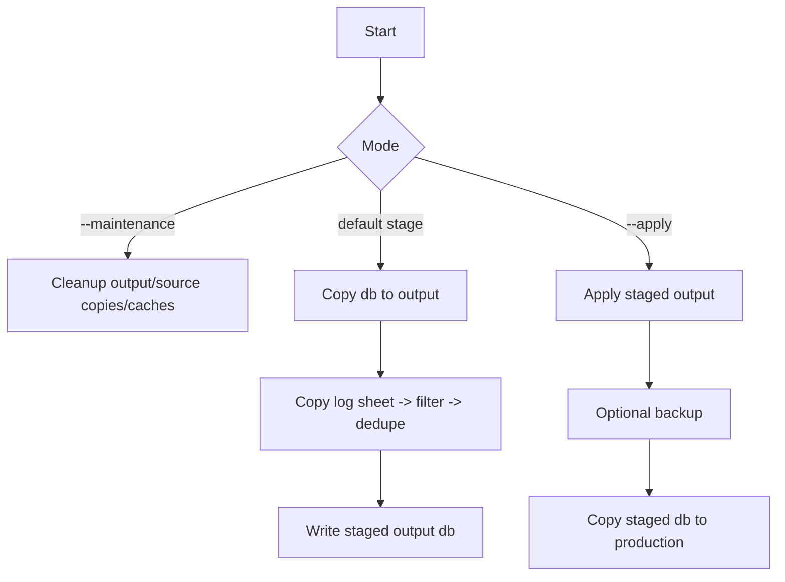

# Cell Analysis DB Update (lean)

Minimal pipeline: copy fresh `Cell_Log.xlsx`, filter by project, skip duplicates already in Slurry, and append new rows. Stage-only is the default to keep production safe.

## Overview




## Quick start

1) Install deps: `pip install -r requirements.txt`  
2) Copy template: `cp config.template.json config.json` and edit paths.  
3) Stage-only (safe default): `python main.py`  
4) Apply to production (after reviewing `output/`): `python main.py --apply`  
5) Maintenance cleanup: `python main.py --maintenance`

## CLI

- `python main.py` — stage-only run; saves modified DB copy to `output/`.
- `--apply` — copy staged output to production DB (backs up if `auto_backup`).
- `--skip-sharepoint` — skip fetching a fresh `Cell_Log.xlsx` from Downloads.
- `--maintenance` — clean `output/`, old source copies (keep 5), and `__pycache__`.

## Config (`config.json`)

```json
{
  "projects": ["Project-A", "Project-B"],
  "source_path": "source_data/Cell_Log.xlsx",
  "work_dir": ".",
  "db_path": "path/to/Cell_Analysis_db.xlsx",
  "sheet_to_copy": "log",
  "target_sheet": "Slurry",
  "unique_key_col": "A",
  "logging_format": "[{timestamp}] {message}",
  "dry_run": true,
  "auto_backup": true
}
```

- `projects`: exact project names to keep.
- `dry_run`: pipeline logic uses stage-only unless `--apply`.
- `auto_backup`: create timestamped backup before live apply.

## Expected files

- Source data: `source_data/Cell_Log.xlsx` (or newest from Downloads via SharePoint helper).  
- Production DB: `db_path` pointing to cellpy database (do not change structure).  
- Output (staged): `output/dryrun_<db>_<ts>.xlsx` plus optional backups.

## Safety and workflow

- Always inspect staged output before `--apply`.
- Duplicate keys (column A) are skipped; existing data preserved.
- Run maintenance periodically to keep workspace small.

## Troubleshooting (fast track)

- Missing source file: ensure `source_data/Cell_Log.xlsx` exists or rerun with fresh download.  
- Target sheet missing: check `target_sheet` matches DB sheet name (default `Slurry`).  
- File locked: close Excel and retry.  
- No new rows: confirm project names in source match `projects` exactly.

## Tests

`python tests/test_refactored.py`
